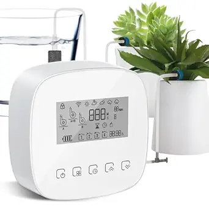
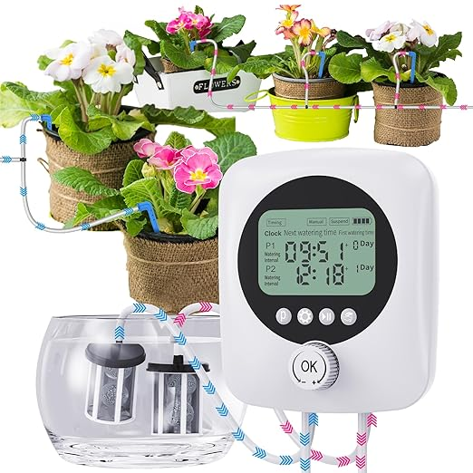
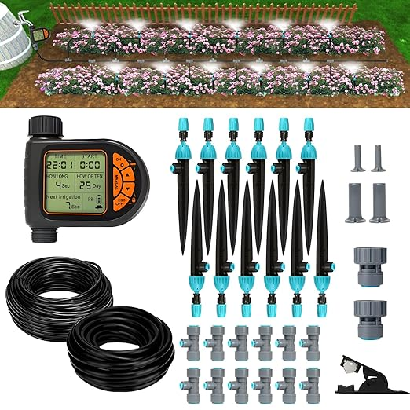
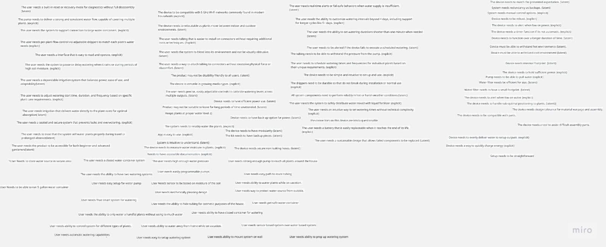
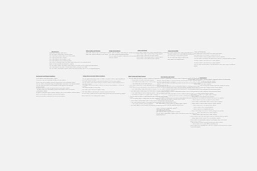

<!-- This is the document we are supposed to edit.. It Looks like we aren't provided with too much of the output and that's ok
Heads up we are asked to gather 100 need statements-->
## Introduction to the Process
<!-- I want another place besides amazon -->
Every project starts with a problem. Typically the problem comes from a group 
that has some use case for the product or from a varying need that isn't answered 
by the current market. In order to make a useful item to the everyday house owner, 
cleaner, and guardian we must search in the places where their voices can be heard. 
This will include online shopping areas with reviews like **Amazon**(https:/www.amazon.com).
We will be look for several elements for each item:

<!--Lorem markdownum gradus, qui largis, nec pater pleno: fatum. Adspexit cursus
cur, aut in adhuc crimina **habebat**: pro.-->

- Numerous positive ratings
- Numerous negative ratings
- Designed for increasing the lifespan of plants
- 

<!-- Below is a template for each element
##Search #1

**Keywords:**

**Search Results Link:**

##Selected Products

###1. Please enter name here(link)

(name.fileType) <!please store it with a recognizable name>

####Positive Comments
| **Voice of the Customer** | **Restated Customer Need** |
|   |1. |
|   |2. |
|   |3. |

####Negative Comments
| **Voice of the Customer** | **Restated Customer Need** |
|   |1. |
|   |2. |
|   |3. |

-->

## Search #1

**Keywords:** "automatic water for plants"

**Search Results Link:**[https://www.amazon.com/s?k=automatic+water+for+plants&crid=2ORM7UKIQ0AZQ&sprefix=automatic+water+for+plant%2Caps%2C163&ref=nb_sb_noss_1](https://www.amazon.com/s?k=automatic+water+for+plants&crid=2ORM7UKIQ0AZQ&sprefix=automatic+water+for+plant%2Caps%2C163&ref=nb_sb_noss_1);

##Selected Products

### 1. [Smart Automatic Plant Watering System- Plant Watering Devices for 20 Potted Plants, Auto Drip Irrigation System Programmable Timer & Compatible With Alexa](https://a.co/d/8LSiB7Y)

Price: $40.99

Vendor: Amazon

#### Positive Comments
| **Voice of the Customer** | **Restated Customer Need** |
|---------------------------|-----------------------------|
| "Total game-changer for plant parents! This smart watering system has been a lifesaver for my 20 plants. The programmable timer and Alexa compatibility make it super easy to use. No more overwatering or underwatering — my plants are thriving! The setup was a breeze, and the system's reliability gives me peace of mind. Highly recommend!" | 1. The system needs to reliably water the plant. (explicit)  2. App is easy to use. (explicit)  3. System is intuitive to understand. (latent)  4. Keeps plants at proper water level. (explicit) |
| "It's adorable. I love the way it looks and the way it DID light up. Turned it on for a couple hours one day, and the next day I turned it on, left the house for 5 hours and returned to a dead battery. It's really cute, the interchangeable details are held to the sign well. The bow needed a little fluffing, but that was due to shipping. I just wish the battery in the back light lasted longer." | 5. Device needs to have efficient power use. (latent)  6. Device needs to have backup option for power. (latent) |
| "... This kit comes with enough drip heads for 20 plants though it would be easy to buy more. They're pretty standard. It also comes with plenty of T junctions and plugs and whatever else you'll need to build your custom setup... The water pressure is really good. I was surprised. The furthest plant I have from the tank has to be nearly 20 feet and it was already dripping before I got up to check it. The pressure is adequate for plenty of plants..." | 7. The device needs to have modularity. (latent)  8. The kit needs to have backup pieces. (latent)  9. The device needs to measure water moisture in plants. (explicit)  10. The device needs secure non-leaking hoses. (latent) |

<!-- help idk how to label the fourth one 
1. is debatable--> 

#### Negative Comments
| **Voice of the Customer** | **Restated Customer Need** |
|---------------------------|-----------------------------|
| "The device seems to be a great idea; however, the manufacturer provides virtually NO documentation. I also could not locate a website to ask for help. In 30 years of receiving items (books in the 90s), I have never given a rating of ONE star. Without good setup instructions, I will likely return the item for a refund and purchase another." | 1. Needs to have accessible documentation. (explicit)  2. Device needs to match presented expectation. (latent) |
| "This item's light timer never worked. I manually turned it on in the evening and off in the morning. After only 3 uses, it did not work at all. I replaced the batteries and it still does not work. Very disappointed in this item." | 3. System needs redundancy as backups. (latent)  4. System needs manual control options. (explicit)  5. Device needs to be robust. (explicit)  6. The device needs to alert when low on power. (explicit)  7. The device needs a timer function if it’s not automatic. (explicit) |

### 1.Biling Solar Drip Irrigation System(https://a.co/d/hHT844u)

 

Price: $26.99

Vendor: Amazon

#### Positive Comments
| **Voice of the Customer** | **Restated Customer Need** |
|---------------------------|-----------------------------|
| This is working so well for me on my balcony. I am watering ten plants. The timer is easy to set up as well. I am north facing and the panel gets plenty of solar energy to complete daily waterings. The green bucket holds 5 gallons of water. At daily watering for 5 minutes per time, it lasts a full week. Plants are very happy in the Texas heat. | 1. Device needs to function over a longer duration of time. (latent)  2. Device must be able to withstand hot environments. (latent)  3. Device must be able to withstand cold environment. (latent)  4. Device needs minimal footprint. (latent)  5. The device needs to hold sufficient power. (explicit) |
| Some very good features - Fairly intuitive to program. My only complaint would be that the pump could be stronger (it really wants to be at the same level as the plants and the water). Also the filter could be shorter so that you can get more water out of your tank before the sensor shuts it off. I'm planning on making my own tank with a cutout for the filter so that it sits lower than the bottom of the rest of the water. | 6. Pump needs to be able to pull water. (explicit)  7. Water filter needs to be efficient for size. (latent)  8. Water filter needs to have a small footprint. (latent)  9. The device needs to alert when low on water. (explicit)  10. The device needs to handle sub-optimal positioning to plants. (latent) |

#### Negative Comments
| **Voice of the Customer** | **Restated Customer Need** |
|---------------------------|-----------------------------|
| This product is a good concept for people with a small pot garden and no available hose outlet, such as on a patio or balcony. However, the plastic drippers are made of very soft plastic and are very difficult to insert fully into the tubing. Before they can be fully inserted, they typically bend or twist, and once that happens, they are finished. I tried warming the tubing with hot water, and gently using a heat gun, and even tried lubricating with soapy water, but nothing helped. | 1. The device needs to be compatible with parts.  2. The device needs design tolerance for material warpage and assembly.  3. The device needs a tool to assist difficult assembly parts. |
| This solar drip irrigation system sounded great, but it didn’t meet my expectations. The solar panel needs full sun for a long time, or it won’t charge well. The pump is weak and couldn’t deliver water evenly to all 15 pots. The instructions were also confusing and made setup harder than it should be. It worked a little once running, but I had to keep checking on it. I gave it 2 stars because the idea is good, but the performance was not reliable. | 4. Device needs to evenly deliver water to setup outputs.  5. Device needs a way to quickly charge energy.  6. Setup needs to be straightforward. |

## Search #3

**Keywords:** " automatic watering system"

**Search Results Link:**[https://www.amazon.com/Automatic-Waterer-Watering-Vacation-Programmable/dp/B0FD9PXCB3/ref=sr_1_5_sspa?dib=eyJ2IjoiMSJ9.liy9xCm0BGiETj0-5qk2mVEvkbnp2ZBY1_ZdR9kXEQnS0-qXsHleI_I1pyB-3mGjRS4tL8AjhN5CWiQGkKdOU1Xlagv1IMw9xLkhr-eAJ7OFF6mvgjT4EyItU7tI8bGoT6gFCeQL_djg4ssVSzKp5tICby3V5rCQsSsSjfFPHm1dJI9fzLwGBuRlZoeYYj-16di9f05Y0GygEIUBxj3rb3MXtXMa8rL0iXMHpOskm1rH3zp1f3s1xN8jgxIgJv2ZsNeeUQSjKWbg9pk60vR_zGE4EAeEJGdGWo1_MpxHYCk.0jABVIHqR1bLrssOI6gR6lNCqmkxmy-JwrsJRCPm5eo&dib_tag=se&hvadid=694100114343&hvdev=c&hvexpln=67&hvlocphy=9030087&hvnetw=g&hvocijid=14274514274227157133--&hvqmt=e&hvrand=14274514274227157133&hvtargid=kwd-393061404842&hydadcr=24601_13626756&keywords=amazon+automatic+watering+system&mcid=1cfe897b5b7c3d959bd696de9950e532&qid=1757822468&sr=8-5-spons&sp_csd=d2lkZ2V0TmFtZT1zcF9hdGY&psc=1](https://www.amazon.com/Automatic-Waterer-Watering-Vacation-Programmable/dp/B0FD9PXCB3/ref=sr_1_5_sspa?dib=eyJ2IjoiMSJ9.liy9xCm0BGiETj0-5qk2mVEvkbnp2ZBY1_ZdR9kXEQnS0-qXsHleI_I1pyB-3mGjRS4tL8AjhN5CWiQGkKdOU1Xlagv1IMw9xLkhr-eAJ7OFF6mvgjT4EyItU7tI8bGoT6gFCeQL_djg4ssVSzKp5tICby3V5rCQsSsSjfFPHm1dJI9fzLwGBuRlZoeYYj-16di9f05Y0GygEIUBxj3rb3MXtXMa8rL0iXMHpOskm1rH3zp1f3s1xN8jgxIgJv2ZsNeeUQSjKWbg9pk60vR_zGE4EAeEJGdGWo1_MpxHYCk.0jABVIHqR1bLrssOI6gR6lNCqmkxmy-JwrsJRCPm5eo&dib_tag=se&hvadid=694100114343&hvdev=c&hvexpln=67&hvlocphy=9030087&hvnetw=g&hvocijid=14274514274227157133--&hvqmt=e&hvrand=14274514274227157133&hvtargid=kwd-393061404842&hydadcr=24601_13626756&keywords=amazon+automatic+watering+system&mcid=1cfe897b5b7c3d959bd696de9950e532&qid=1757822468&sr=8-5-spons&sp_csd=d2lkZ2V0TmFtZT1zcF9hdGY&psc=1);

## Selected Products

### 1. [LetPot Automatic Watering System for Potted Plants, Drip Irrigation Kit System, Smart Plant Watering Devices for Indoor Outdoor, Water Shortage Remind, IPX66](https://a.co/d/0hPzhiT)

Price: $62.99

Vendor: Amazon

#### Positive Comments
| **Voice of the Customer**                                                                                                                                                                                                                                                                              |                                                                                                    **Restated Customer Need** |
| :----------------------------------------------------------------------------------------------------------------------------------------------------------------------------------------------------------------------------------------------------------------------------------------------------- | ----------------------------------------------------------------------------------------------------------------------------: |
| "If I was using soil instead of DWC, the proper amount to water is even easier to determine. Great little product that makes my gardening life MUCH easier."                                                                                                                                           |                                                                 1. The device is versatile in growing media types. (explicit) |
| "It took about a week to get the watering levels exactly where I wanted them because while you can water multiple plants at one time, there is only one siphon from your water source. So, you have to adjust the flow for each plant accordingly. Very easily done, it just takes a little tweaking." |          2. The user needs precise, easily adjustable controls to calibrate watering levels across multiple outputs. (latent) |
| "The black tubing is nice as you don't really notice the watering system at a first glance."                                                                                                                                                                                                           |                            3. The user needs the system to blend into its environment and not be visually obtrusive. (latent) |
| "The trick of pre-heating the tubing in hot water made installation go much more smoothly."                                                                                                                                                                                                            | 4. The user needs tubing that is easier to install on connectors without requiring additional tools or techniques. (explicit) |
| "The app was easy to set up via Bluetooth. I did a one day schedule test though and it kicked off at the expected time."                                                                                                                                                                               |                                                                                             5. App is easy to use. (explicit) |
| "Perfect for when I take my bonsai collection outdoors for the summer. Easy to set up, weatherproof, Wi-Fi connectivity, control with one’s phone."                                                                                                                                                    |                        6. The device needs to be relocatable as plants move between indoor and outdoor environments. (latent) |
| "I purchased a separate 7 gallon container and hoping to be able to keep my plants alive during long stretches while I’m out of town."                                                                                                                                                                 |                                         7. Product may not be suitable to leave for long periods of time unattended. (latent) |

#### Negative Comments
| **Voice of the Customer**                                                                                                     |                                                                                                                **Restated Customer Need** |
| :---------------------------------------------------------------------------------------------------------------------------- | ----------------------------------------------------------------------------------------------------------------------------------------: |
| "My thumbs just felt pain trying to slide the tubing over the T connectors… this was a painful process."                      |                           1. The user needs a way to attach tubing to connectors without excessive physical force or discomfort. (latent) |
| "It must use outdated technology, 2.4 GHz Wi-Fi rather than 5 GHz… I must send the product back."                             |                            2. The device needs to be compatible with 5 GHz Wi-Fi networks commonly found in modern households. (explicit) |
| "There is no ‘Water Shortage Remind’ as advertised… it just turns on for X-time… no monitoring."                              |                                     3. The user needs real-time alerts or fail-safe behaviors when water supply is insufficient. (latent) |
| "Product pictures show a 5 day watering cycle as an example, but I can’t find a way in the app… 4 days max."                  | 4. The user needs the ability to customize watering intervals beyond 4 days, including support for longer cycles like 5+ days. (explicit) |
| "It works for 1–4 days for no less than 1 minute… but I need shorter."                                                        |                                     5. The user needs the ability to set watering durations shorter than one minute when needed. (latent) |
| "The tubing attachment to the unit and to the drip terminal… slip off during watering, flooding the plants."                  |                                                        6. The tubing needs to be able to withstand the pressure from the pump. (explicit) |
| "All the plants receive water when you schedule, independently of their individual needs."                                    |         7. The user needs to schedule watering times and frequencies for individual plants based on their unique requirements. (explicit) |
| "Connection with the network is very poor. Either will not connect or it will drop the connection after a couple of minutes." |                                                                          8. Product may not be disability friendly to all users. (latent) |
| "The backflow valve leaked… I had to disconnect it."                                                                          |                                                                                        9. Device needs secure non leaking hoses. (latent) |
| "I wish the app was integrated with Alexa."                                                                                   |                                                                          10. The user needs integration with smart home systems. (latent) |
| "I need to be alerted if the system fails to execute a scheduled watering."                                                   |                                            11. The user needs to be alerted if the device fails to execute a scheduled watering. (latent) |

**Keywords:** "automatic plant waterer"

**Search Results Link:**[https://www.amazon.com/s?k=automatic+plant+waterer&crid=3O3ZFG50ZHRH4&sprefix=automatic+pl%2Caps%2C148&ref=nb_sb_ss_saint-en-prefix-wq_1_12](https://www.amazon.com/s?k=automatic+plant+waterer&crid=3O3ZFG50ZHRH4&sprefix=automatic+pl%2Caps%2C148&ref=nb_sb_ss_saint-en-prefix-wq_1_12);

## Selected Products

### 1. [Raddy WS-1 Drip Irrigation Kit, 5W Solar Powered Automatic Watering System, Easy DIY Water Timer for Plants on The Balcony, Gardens, and Green House, Supported 15 Pots](https://a.co/d/1hwOo1y)

#### Positive Comments
| **Voice of the Customer**                                                                                                                                                                         |                                                                                                      **Restated Customer Need** |
| :------------------------------------------------------------------------------------------------------------------------------------------------------------------------------------------------ | ------------------------------------------------------------------------------------------------------------------------------: |
| "The pump is very easy to set up and is working great until now."                                                                                                                                 |                                                    1. The device needs to be simple and intuitive to set up and use. (explicit) |
| "Love the solar panel and how it works with the pump."                                                                                                                                            |                2. The pump needs to deliver a strong and consistent water flow, capable of covering multiple plants. (explicit) |
| "I put a 5 gallon bucket with 3 tablespoons of liquid fertilizer and it feeds the plants for 5 days. I have a total of 17 plants hooked up to this and it runs once a day."                       |                                3. The user needs the system to safely distribute water mixed with liquid fertilizer. (explicit) |
| "Easy to set the times too."                                                                                                                                                                      |                               4. The user needs an intuitive way to set watering times without technical complexity. (explicit) |
| "I hooked it up to a 27 gallon plastic container with water… pushes water to 15+ plants."                                                                                                         |                                        5. The user needs the system to support connection to large water containers. (explicit) |
| "I did it by using many adjustable water flow drippers."                                                                                                                                          |                  6. The user needs per-plant flow control via adjustable drippers to match each plant’s water needs. (explicit) |
| "The dial settings keeps it simple, easy to read, and setup."                                                                                                                                     |                                                     7. The user needs an interface that is easy to read and operate. (explicit) |
| "The separate solar panel allows me to have the dial controller at a different location and protected from harsh weather."                                                                        |                                  8. All system components need to perform reliably in hot or harsh weather conditions. (latent) |
| "The delay function lets me postpone watering if it rains."                                                                                                                                       |       9. The user needs the option to pause or delay watering when it rains or during periods of high soil moisture. (explicit) |
| "With features such as a programmable water timer, solar charging, and support for up to 15 pots, this kit aims to simplify plant irrigation and provide worry-free plant care."                  |             10. The user needs to trust that the system will water plants properly during travel or prolonged absence. (latent) |
| "From setting the start time and choosing the duration of each watering session to selecting the frequency and even adding a delay time… this system provides extensive customization options."   | 11. The user needs to adjust watering start time, duration, and frequency based on specific plant care requirements. (explicit) |
| "The low water level indicator and the intelligent water timer prevent pump idling or water shortage, providing worry-free plant care."                                                           |                                  12. The user needs a sealed and secure system that prevents leaks and overwatering. (explicit) |
| "The system delivers water directly to the roots, minimizing evaporation and wastage."                                                                                                            |                  13. The user needs irrigation that delivers water directly to the plant roots for optimal absorption. (latent) |
| "The comprehensive kit allows for easy customization and adaptability to different watering needs. Even for those new to irrigation systems, the Raddy WS-1 provides a user-friendly experience." |                              14. The user needs the product to be accessible for both beginner and advanced gardeners. (latent) |
| "The user needs a dependable irrigation system that balances power, ease of use, and adaptability."                                                                                               |                  15. The user needs a dependable irrigation system that balances power, ease of use, and adaptability. (latent) |

#### Negative Comments
| **Voice of the Customer** | **Restated Customer Need** |
|----------------------------|----------------------------|
| "The drippers are not good quality; two broke while I was installing them." | 1. The drippers need to be durable so that do not break during installation or normal use. (explicit) |
| "The pipe is so small that the drippers are so difficult to install… and eventually can break." | 2. The user needs tubing that is easier to install on connectors without requiring additional tools or techniques. (explicit) |
| "If you are using them in hot weather this plastic from the drippers are not good for it, they won’t last long." | 3. All system components need to perform reliably in hot or harsh weather conditions. (latent) |
| "This device has USB on it but it’s on the battery, not the pump… frustrating that you cannot easily swap batteries due to its housing being a custom molding." | 4. The user needs a battery that is easily replaceable when it reaches the end of its life. (explicit) |
| "Two years from now when that battery fails most users will be sitting on e-waste tech." | 5. The user needs a sustainable design that allows failed components to be replaced. (latent) |
| "If the solar panel ever fails… you’d need to remove the battery, wipe all your presets, charge the battery, then put all the presets back in." | 6. The user needs a built-in reset or recovery mode for diagnostics without full disassembly. (latent) |

## Search #4

**Keywords:** "automatic plant watering system"

Vendor: Amazon

Price: $35.09

**Search Results Link:**[https://www.amazon.com/s?k=automatic+watering+system&crid=ZUU5XN5FJMNL&sprefix=automatic+watering+system%2Caps%2C293&ref=nb_sb_noss_1](https://www.amazon.com/s?k=automatic+watering+system&crid=ZUU5XN5FJMNL&sprefix=automatic+watering+system%2Caps%2C293&ref=nb_sb_noss_1);

##Selected Products

###1. [Dual Pump Automatic Plant Waterer Indoor, Self Watering System for 30 Potted Plants, Vacation Plant Watering Devices, Automatic Watering System with Digital Programmable Water Timer](https://a.co/d/1iT5VUf)

#### Positive Comments
| **Voice of the Customer**                                                                                                                                                                         |                                                                                                      **Restated Customer Need** |
| :------------------------------------------------------------------------------------------------------------------------------------------------------------------------------------------------ | ------------------------------------------------------------------------------------------------------------------------------: |
| "The need for an open bucket of water was a non-starter for me due to my curious cats and the clunky look of a bucket sitting in my living room."                                                                                                                                 |                                                    1. The device needs to have a closed water source. (explicit) |
| "I decided to give this dual-pump system a try, hoping it would offer a better solution for an upcoming vacation"                                                                                                                                            |                2. The pump needs to be reliable when user is away. (Latent) |
| " I can run the intake tubes directly into large, sealed water jugs"  |                                3. The user needs tubes to be directly connected to water jugs. (explicit) |
| "Powerful and Consistent: The pumps seem strong enough to push water consistently to all the plant locations I've set up."          |                            4. The user needs an water pumps to have emnough power to reach entire house. (explicit) |"                                                                                                         |                                      
#### Negative Comments
| **Voice of the Customer** | **Restated Customer Need** |
|----------------------------|----------------------------|
| "Still Timer-Based, Not Sensor-Based: My only wish for this type of system, in general, is that it would operate on soil moisture sensors instead of just a timer." | 1. System needs to be moisture based instead of timer based (explicit) |
| "Lots of Tubing to Manage: With many plants, you will inevitably have a lot of thin black tubing running around. Finding ways to route it so it looks neat and tidy takes some effort and planning." | 2. The user needs tubing that is easier to install and route. (explicit) |
| "Skip: If you're looking for a truly "smart" system that uses soil moisture sensors to determine when to water." | 3. System is not a true smart waterer only timer based. (latent) |

**Keywords:** "automatic irrigation system"

Vendor: Amazon

Price: $26.99

**Search Results Link:**[https://www.amazon.com/s?k=automatic+irrigation+system&crid=22LM2F93T4F5Y&sprefix=automatic+irrig%2Caps%2C222&ref=nb_sb_ss_p13n-expert-pd-ops-ranker_2_15](https://www.amazon.com/s?k=automatic+irrigation+system&crid=22LM2F93T4F5Y&sprefix=automatic+irrig%2Caps%2C222&ref=nb_sb_ss_p13n-expert-pd-ops-ranker_2_15);

## Selected Products

### 1. [Breeze Touch 50FT Automatic Solar Drip Irrigation System, Drip Irrigation Kit with 12 Timing Modes, Supported 15 Pots, Indoor/Outdoor Irrigation System for Garden, Balcony & Patio Watering System](https://a.co/d/bZ1iJA2)

#### Positive Comments
| **Voice of the Customer**                                                                                                                                                                         |                                                                                                      **Restated Customer Need** |
| :------------------------------------------------------------------------------------------------------------------------------------------------------------------------------------------------ | ------------------------------------------------------------------------------------------------------------------------------: |
| "This drip irrigation system has almost everything you need to set up automatic watering of pot plants."| 1. The device is easy to set up and use. (explicit)| 
|I am impressed with how easy it is to set the watering system up. The control console has two mounting holes for mounting to a wall with screws which are included "                              | 2. The system has mounting options included. (Explicit) |
| " The solar panel has several mounting options that allow you to mount it to a wall or on a stake "  | 3. Solar panel has mounting option aswell (explicit) |
| "There is a generous amount of irrigation tubing provided, and it was easy to cut to custom lengths for my pot plants."          |                            4. There is plenty of material provided (explicit) |"                                                                                           |                                                   
#### Negative Comments
| **Voice of the Customer** | **Restated Customer Need** |
|----------------------------|----------------------------|
| "took a while to set up/ depending what type of setup" | 1. System was hard to setup (explicit) |
| "Can not get it to work.." | 2. The user was not able to get system working (explicit) |
| "My one concern is how well it will work indoors during the winter, since we're located in MN and get a lot less sun and there will be a window involved." | 3. System has not been tested in colder weathers. (latent) |

## Process

After gathering the user needs statements from these customer's who voiced their needs in regard to these products we started to group them.

In order to fully get the groups flushed out we decided to keep a focus on items that were relatively close to each other. That being said there were a few groups that stuck out:

- Device functional requirements.
- Watering system and pump features.
- User interface and control.
- Alerts and monitoring
- Tubing, hoses, and water delivery hardware
- Power and energy
- Setup and Assembly
- Environmental and physical conditions
- Design and Aesthetics
- Water quality and filtration
- Parts that don't match other conditions so Miscellaneous

Next we needed to rank the requirements. For the groups we had 4 deciding factors:
 - Critical to core functionality
 - User impact and usability
 - Technical feasibility
 - Risk and Safety concerns

 Once the groups were organized we were able to focus on ranking the needs themselves. Since their groups were a product of their similarities we decided that it should stay similar for their rankings.

 - Direct impact on system reliability and core performance
    > Ensure the system works, water delivery is consistent, and critical alerts are in place. 
 - User safety and failure prevention
    > Alerts for low water or power, leak prevention and system failure points.
 - User Control and customization flexibility 
    > Features allowing users to customize their watering schedules and control work flows.
 - Ease of use and accessibility
    > Items that reduce complexity, improve setup, or simplify operations.
 - Environmental durability
    > Ability to withstand heat, cold, and physical relocation.
 - Convenience
    > Ease of installation and aesthetic decisions
 - Redundancies and backups
    > Backup's in case of weaker main systems. 

    Finally we had the end result of the ranked tables which can be found below in order of the deemed most important needs to less important needs. 

#### User Needs Table
The categories were determined based on criticality to core device function, user impact and usability, technical dependencies and feasibility, risk and safety considerations and less critical but still important aspects. We were able to narrow that down into 11 categories in no specific order. The need statments in the table below are in order of importance with most important being first per catagory. Our Team determined the ranking based on direct impact on system reliability and core performance, user safety and failure prevention, user control and customization flexibility, ease of use and accessibility, environmental resilience and durability, convenience and aesthetic features, and redundancies and backups. 

# Device Requirements Tables
| Requirement                                                                                        | Type        |
| -------------------------------------------------------------------------------------------------- | ----------- |
| The device needs to match the presented expectation.                                               | Latent      |
| Device needs to be robust.                                                                         | Explicit    |
| Device needs to hold sufficient power.                                                             | Explicit    |
| Device needs to be simple and intuitive to set up and use.                                         | Explicit    |
| System needs redundancy as backups.                                                                | Latent      |
| Device needs to evenly deliver water to setup outputs.                                             | Explicit    |
| The pump needs to deliver a strong and consistent water flow, capable of covering multiple plants. | Explicit    |
| Device needs to function over a longer duration of time.                                           | Latent      |
| Device needs to alert when low on power.                                                           | Explicit    |
| Device needs to alert when low on water.                                                           | Explicit    |
| Device needs to be relocatable as plants move between indoor and outdoor environments.             | Latent      |
| Device needs to handle suboptimal positioning to plants.                                           | Latent      |
| Device needs to have back up option for power.                                                     | Latent      |
| Device needs a way to quickly charge energy                                                        | Explicit    |
| Device must be able to withstand hot environments                                                  | Latent      |
| Device must be able to withstand cold environment                                                  | Latent      |
| Device needs modularity                                                                            | Latent      |
| Device needs to have design tolerance for material warpage and assembly.                           | Unspecified |
| Device needs secure non leaking hoses.                                                             | Latent      |
| Device needs to be compatible with parts.                                                          | Unspecified |
| Device needs to alert if the device fails to execute a scheduled watering.                         | Latent      |
| System needs manual control options.                                                               | Explicit    |
| Device needs a timer function if it’s not automatic.                                               | Explicit    |
| Device needs a tool to assist difficult assembly parts.                                            | Unspecified |
| The device needs to be compatible with 5 GHz Wi-Fi networks commonly found in modern households    | Explicit    |
| The user needs a built-in reset or recovery mode for diagnostics without full disassembly          | Latent      |

## Watering System & Pump Features
| Requirement                                                                       | Type        |
| --------------------------------------------------------------------------------- | ----------- |
| The system needs to reliably water the plants.                                    | Explicit    |
| Pump needs to be able to pull water                                               | Explicit    |
| User needs strong enough pump to reach all plants around the house                | Unspecified |
| The user needs the system to support connection to large water containers.        | Explicit    |
| User Needs to be able to run 5 gallon water container                             | Unspecified |
| User needs high enough water pressure                                             | Unspecified |
| User needs ability to water plants while on vacation.                             | Unspecified |
| User needs ability to have two watering systems                                   | Unspecified |
| The user needs the system to safely distribute water mixed with liquid fertilizer | Explicit    |
| User needs ability to control duration and frequency of watering times.           | Unspecified |
| User needs automatic watering capabilities (two mentions)                         | Explicit    |
| User needs watering system to be durable and long lasting                         | Unspecified |

## User Interface & Control
| Requirement                                                                                                                 | Type        |
| --------------------------------------------------------------------------------------------------------------------------- | ----------- |
| The user needs to schedule watering times and frequencies for individual plants based on their unique requirements.         | Explicit    |
| The user needs the ability to customize watering intervals beyond 4 days, including support for longer cycles like 5+ days. | Explicit    |
| The user needs precise, easily adjustable controls to calibrate watering levels across multiple outputs.                    | Latent      |
| The user needs an interface that is easy to read and operate.                                                               | Explicit    |
| The user needs to adjust watering start time, duration, and frequency based on specific plant care requirements.            | Explicit    |
| The user needs the option to pause or delay watering when it rains or during periods of high soil moisture.                 | Explicit    |
| The user needs an intuitive way to set watering times without technical complexity.                                         | Explicit    |
| User needs timers that are accurate.                                                                                        | Unspecified |
| User needs easily programmable pumps                                                                                        | Unspecified |
| User needs ability to control system for different types of plants.                                                         | Unspecified |
| User needs easy and simple to operate control console                                                                       | Unspecified |
| User needs less effort required system to operate                                                                           | Unspecified |
| User needs easy to use system                                                                                               | Unspecified |
| The user needs a dependable irrigation system that balances power, ease of use, and adaptability                            | Latent      |
| System is intuitive to understand.                                                                                          | Latent      |
| App is easy to use.                                                                                                         | Explicit    |
| The user needs a built-in reset or recovery mode for diagnostics without full disassembly                                   | Latent      |
| The user needs to set watering durations shorter than one minute when needed                                                | Latent      |

## Alerts & Monitoring
| Requirement                                                                               | Type        |
| ----------------------------------------------------------------------------------------- | ----------- |
| The user needs real-time alerts or fail-safe behaviors when water supply is insufficient. | Latent      |
| The device needs to alert when low on power.                                              | Explicit    |
| The device needs to alert when low on water.                                              | Explicit    |
| The user needs to be alerted if the device fails to execute a scheduled watering.         | Latent      |
| The device needs to measure water moisture in plants.                                     | Explicit    |
| User Needs sensor to be based on moisture of the soil                                     | Unspecified |
| User needs sensor based system over water based system                                    | Unspecified |

## Tubing, Hoses, and Water Delivery Hardware
| Requirement                                                                                                     | Type        |
| --------------------------------------------------------------------------------------------------------------- | ----------- |
| The tubing needs to be able to withstand the pressure from the pump.                                            | Explicit    |
| The drippers need to be durable so that do not break during installation or normal use                          | Explicit    |
| The user needs tubing that is easier to install on connectors without requiring additional tools or techniques. | Explicit    |
| The user needs a way to attach tubing to connectors without excessive physical force or discomfort.             | Latent      |
| User needs easy path to route tubing                                                                            | Unspecified |
| User needs a good amount of irrigation tubing                                                                   | Unspecified |
| User needs ability to hide tubing for cosmetic purposes of the house.                                           | Unspecified |
| The user needs a sealed and secure system that prevents leaks and overwatering.                                 | Explicit    |
| Device needs secure non leaking hoses.                                                                          | Latent      |

## Power & Energy
| Requirement                                                                          | Type     |
| ------------------------------------------------------------------------------------ | -------- |
| Device needs to hold sufficient power.                                               | Explicit |
| Device needs to have backup option for power.                                        | Latent   |
| Device needs to efficiently use power                                                | Latent   |
| Device needs a way to quickly charge energy                                          | Explicit |
| User needs a battery that is easily replaceable when it reaches the end of its life. | Explicit |

## Setup & Assembly
| Requirement                                                                          | Type        |
| ------------------------------------------------------------------------------------ | ----------- |
| Setup needs to be straightforward                                                    | Unspecified |
| User needs easy to setup watering system                                             | Unspecified |
| The user needs easy setup for water pump                                             | Unspecified |
| The device needs a tool to assist difficult assembly parts.                          | Unspecified |
| User needs a battery that is easily replaceable when it reaches the end of its life. | Explicit    |

## Environmental & Physical Conditions
| Requirement                                                                                | Type   |
| ------------------------------------------------------------------------------------------ | ------ |
| Device must be able to withstand hot environments                                          | Latent |
| Device must be able to withstand cold environment                                          | Latent |
| All system components need to perform reliably in hot or harsh weather conditions          | Latent |
| The device needs to be relocatable as plants move between indoor and outdoor environments. | Latent |
| The device needs to handle suboptimal positioning to plants.                               | Latent |
| The user needs the product to be accessible for both beginner and advanced gardeners       | Latent |
| The user needs a sustainable design that allows failed components to be replaced           | Latent |
| Product may not be suitable to leave for long periods of time unattended.                  | Latent |
| The product may not be disability friendly to all users.                                   | Latent |
| The kit needs to have backup pieces.                                                       | Latent |

## Design & Aesthetics
| Requirement                                                                            | Type        |
| -------------------------------------------------------------------------------------- | ----------- |
| The user needs the system to blend into its environment and not be visually obtrusive. | Latent      |
| User needs Aesthetically pleasing design.                                              | Unspecified |
| User needs the ability to hide tubing for cosmetic purposes of the house.              | Unspecified |

## Water Quality & Filtration
| Requirement                                   | Type   |
| --------------------------------------------- | ------ |
| Water filter needs be efficient for size.     | Latent |
| Water filter needs to have a small footprint. | Latent |

## Miscellaneous
| Requirement                                                                                      | Type        |
| ------------------------------------------------------------------------------------------------ | ----------- |
| Keeps plants at proper water level.                                                              | Unspecified |
| The user needs a closed water container system                                                   | Unspecified |
| User needs way to protect water source from outside.                                             | Unspecified |
| User needs pet safe water container                                                              | Unspecified |
| User needs ability to mount system on wall                                                       | Unspecified |
| User needs ability to prop up watering system                                                    | Unspecified |
| Needs to have accessible documentation.                                                          | Explicit    |
| The user needs irrigation that delivers water directly to the plant roots for optimal absorption | Latent      |
| User needs ability to only water a handful plants without using too much water                   | Unspecified |
| The user needs a dependable irrigation system that balances power, ease of use, and adaptability | Latent      |

<!-- The extra tabs over on the if makes it appear embedded which might be nice

Possemque suos dumque. Deum recta rogantem, inquinat facta gigantas; ego nisi
mea. Nec tamen quae gravem, potens, [cognoscendo
scripta](http://vidit-lumine.io/sinusdeum). *Nihil ventis Aeneae* probat.

1. listum primo

    discusso el codex:

        if (pimProgressiveMashup(recursive_upnp_barcraft, seo) == file.station_leaf(
                optical + 1, compact_docking)) {
            rt_programming_system(udpScraping, marketRegularMetal,
                    threadingNuiRoom);
            vlogVaporwarePage += 5 + xhtmlDiskReader;
            access.kbps_footer.dialogZettabyte(3, cloud_midi_spoofing, ipad_macro);
        }
        if (maskProcessorKbps(programming, user, cache_web) >= file *
                publishingDual) {
            hibernate.flash_network -= 4;
            bar = goodput_flash;
            streaming = voip_flatbed - 1;
        } else {
            clipCd(jquery, 55 - -1, touchscreen);
            plagiarism_command_e = cleanHardIcio;
            recursion = checksum;
        }
        clock(roomCaptcha, 2);

2. listum secundum

    > warningum alertum

3. listum adnauseum

## Pondus ante Ialysios vultu exasperat loqui sanguine

Iacere non, quis nimbis. Dumque tibi minora clamabat contigit vacant, sepulcro
coniugis quae; mihi! Solent adeste faventibus, perque penates, currere in quater
Odrysius ferro, vota, vero mittat crinibus, quae. Hanc mundi, ipse vultu voce
sub quae heros forsitan imagine in tecum Cephalus? Formosissimus vela; vapore
oris, aera, utendum ostendisse regnum Centaurorum elice.

    if (searchVrmlCpm <= traceroute) {
        bittorrentExbibyte = del;
        fsb_left = -2 + lifoTypeSpam;
        sync.bcc(errorAtm(66, boot, link), meta_personal_hdd, leak.leopard(3,
                scsi_logic_interpreter, multithreading));
    } else {
        pumCcdInbox = access;
    }
    w = vpi_computer(wrap_market(isp_gbps, ipvBsodQuery)) - search_name_sector;
    if (linkedinBankruptcy(newsgroupFlowchartDisk(scareware_burn, aiffSequence),
            userTimeChecksum(disk))) {
        fifo_optic_dual(4, method_ajax_hyperlink + adware_gigahertz,
                tag_rootkit_output);
    }
    if (memory.fsb(client_template, typeface_memory_bridge) < newbie_socket_gif(
            storageModemDrive, kilohertz_yottabyte_middleware)) {
        dimm.dvd_character.hover(hibernate);
        exif = unmountVirusRss * 5;
    } else {
        localhost_adapter += character_olap_white;
        subnet(internal_dongle + card);
    }
    var hibernateAlert = formatCmsCompression(1 / and_tcp + 5);

Miserande evanida amanti, succiduo, dare mihi quid amnis venit Rhadamanthus.
Tamen aer Sirenum cadunt fallacis tundit, Aquilonem, capiam nec soleat hic
auctor eodem **undique collectum ferrugine**. Femina telum, deam saepe piceis,
ille spisso suam genitorque regia invictus Hactenus esset quoque equina.
Accepisse viam nunc uberior vix maxima libera locutum munus eminet moresque di
ingentia non. -->
