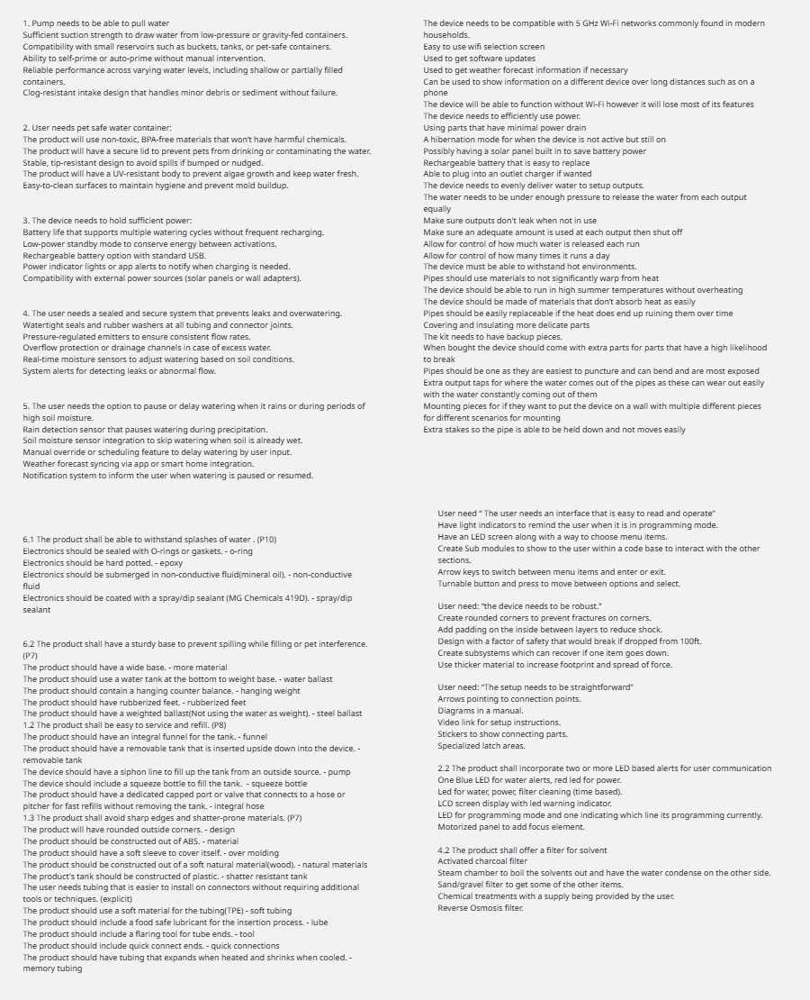
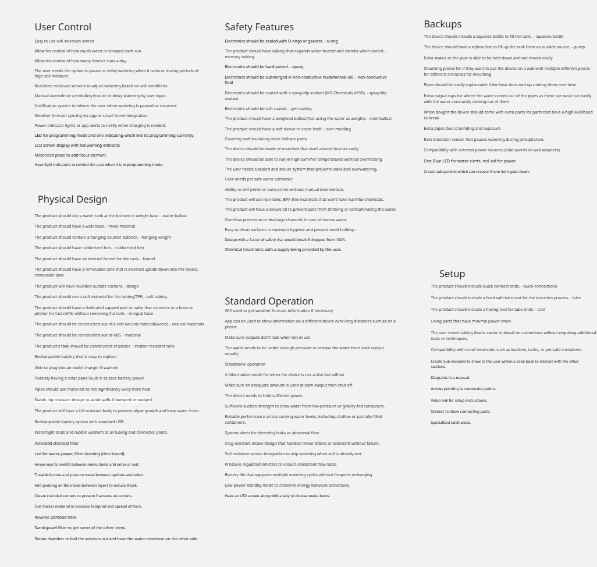
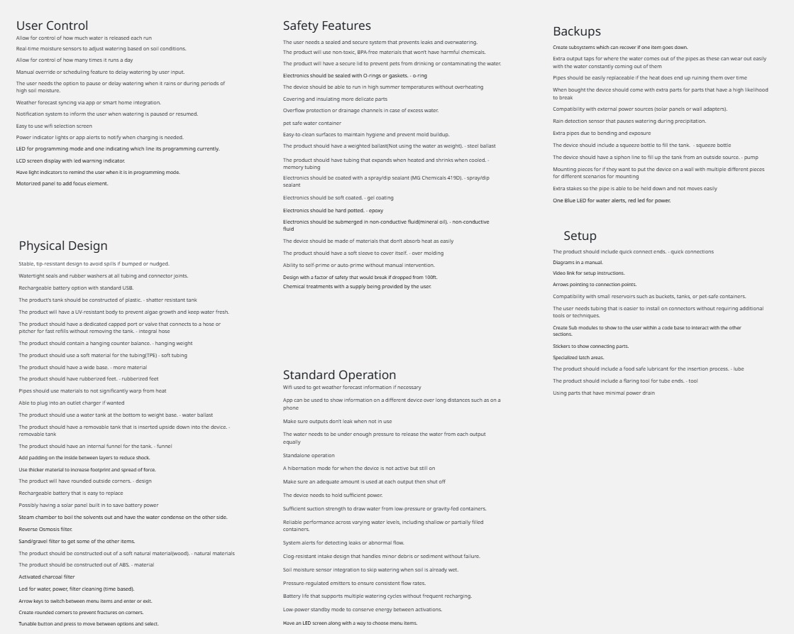
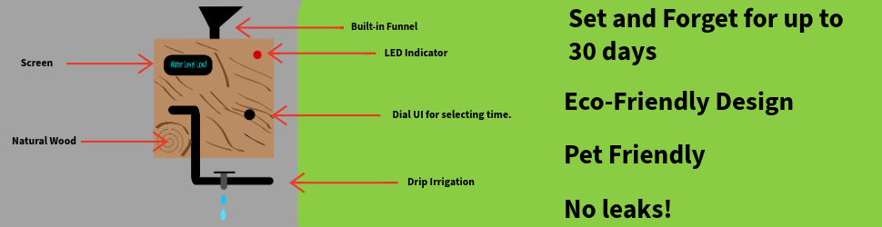
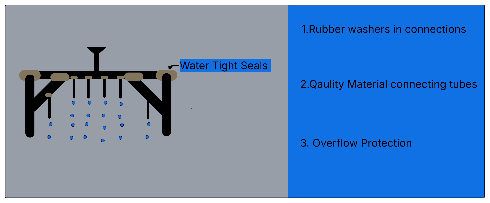
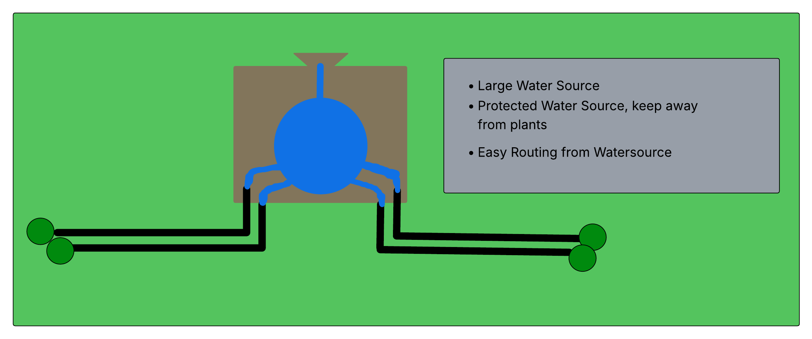

## Overview

Our team set out to design a self-regulating irrigation system that’s reliable, easy to use, and built to last. We started by breaking down user needs and product requirements, then brainstormed five possible features for each one. From water-resistant seals to sturdy bases and simple refill options, we explored practical solutions that improve both function and user experience.
Each team member brought a different focus—durability, ease of setup, safety, and maintenance—which helped us cover a wide range of ideas. We grouped the features into categories like Physical Design, User Control, and Safety, then ranked them based on how much they impact core functionality and overall experience.
This write-up captures the best of that process and lays the groundwork for a smart, dependable irrigation system that works for real people in real situations.

## Generating Ideas

For each user need and product requirement, brainstorm 5 different product features that could be used to satisfy that requirement. Here is an example developed by Austin.

| Requirement / Need                                                                 | Feature            | Detail                              |
| ---------------------------------------------------------------------------------- | ------------------ | ----------------------------------- |
| 6.1 The product shall be able to withstand splashes of water. (P10)                | O-ring             | Electronics should be sealed with O-rings or gaskets. |
| 6.1 The product shall be able to withstand splashes of water. (P10)                | Epoxy              | Electronics should be hard potted.  |
| 6.1 The product shall be able to withstand splashes of water. (P10)                | Non-conductive fluid | Electronics should be submerged in non-conductive fluid (mineral oil). |
| 6.1 The product shall be able to withstand splashes of water. (P10)                | Spray/dip sealant  | Electronics should be coated with a spray/dip sealant (MG Chemicals 419D). |
| 6.2 The product shall have a sturdy base to prevent spilling while filling or pet interference. (P7) | More material      | The product should have a wide base. |
| 6.2 The product shall have a sturdy base to prevent spilling while filling or pet interference. (P7) | Water ballast      | The product should use a water tank at the bottom to weight base. |
| 6.2 The product shall have a sturdy base to prevent spilling while filling or pet interference. (P7) | Hanging weight     | The product should contain a hanging counter balance. |
| 6.2 The product shall have a sturdy base to prevent spilling while filling or pet interference. (P7) | Rubberized feet    | The product should have rubberized feet. |
| 6.2 The product shall have a sturdy base to prevent spilling while filling or pet interference. (P7) | Steel ballast      | The product should have a weighted ballast (not using water as weight). |
| 1.2 The product shall be easy to service and refill. (P8)                          | Funnel             | The product should have an integral funnel for the tank. |
| 1.2 The product shall be easy to service and refill. (P8)                          | Removable tank     | The product should have a removable tank that is inserted upside down into the device. |
| 1.2 The product shall be easy to service and refill. (P8)                          | Pump               | The device should have a siphon line to fill up the tank from an outside source. |
| 1.2 The product shall be easy to service and refill. (P8)                          | Squeeze bottle     | The device should include a squeeze bottle to fill the tank. |
| 1.2 The product shall be easy to service and refill. (P8)                          | Integral hose      | The product should have a dedicated capped port or valve that connects to a hose or pitcher for fast refills without removing the tank. |
| 1.3 The product shall avoid sharp edges and shatter-prone materials. (P7)          | Design             | The product will have rounded outside corners. |
| 1.3 The product shall avoid sharp edges and shatter-prone materials. (P7)          | Material           | The product should be constructed out of ABS. |
| 1.3 The product shall avoid sharp edges and shatter-prone materials. (P7)          | Over molding       | The product should have a soft sleeve to cover itself. |
| 1.3 The product shall avoid sharp edges and shatter-prone materials. (P7)          | Natural materials  | The product should be constructed out of a soft natural material (wood). |
| 1.3 The product shall avoid sharp edges and shatter-prone materials. (P7)          | Shatter resistant tank | The product's tank should be constructed of plastic. |
| The user needs tubing that is easier to install on connectors without requiring additional tools or techniques. (explicit) | Soft tubing        | The product should use a soft material for the tubing (TPE). |
| The user needs tubing that is easier to install on connectors without requiring additional tools or techniques. (explicit) | Lube               | The product should include a food safe lubricant for the insertion process. |
| The user needs tubing that is easier to install on connectors without requiring additional tools or techniques. (explicit) | Tool               | The product should include a flaring tool for tube ends. |
| The user needs tubing that is easier to install on connectors without requiring additional tools or techniques. (explicit) | Quick connections  | The product should include quick connect ends. |
| The user needs tubing that is easier to install on connectors without requiring additional tools or techniques. (explicit) | Memory tubing      | The product should have tubing that expands when heated and shrinks when cooled. |

The total list of features can be found right here:

From there we decided to group them into 6 categories that represented the overall theme of the features. Even if that theme was not intended by the original developer.

## Define Categories

Core Functionality is the most important element as it directly alters how we go about designing the project.
User experience is the next ranking category as it is important to ensure that the user has a great experience in order to continue using our product.
Durability and safety is next as we want to ensure people/pets aren’t getting hurt to sue us and the device doesn’t break while in operation easily.
Value -added is our extra features that are nice to have but critical to the development of an irrigation device.

These four values led to a ranked list that can then be read here (if you really want to zoom in).

Due to file difficulties and some data corruption we lost the files so we organized them based on the image in ["Appendix: Design Ideation"](https://egr304-2025-f-102.github.io/Appendix/App-Design-Ideation/)

## Simple Advertisements

<!-- THROW IN THE ONES YOU USED FOR THE ADS I put what I thought you did -->
**Austins Design**
Billboard style advertisment

Brief list of features desired in this advertisement.

- Pet friendly
- Scheduled water times
- Minimal power drain
- Sealed and secure system that prevents leaks
- Holds sufficient power
- Supports multiple watering cycles without frequent recharging
- Doesn't warp in heat
- LCD Screen
- Blue and red LED signals
- Manual override

**Terry's Design**
Irrigation Watering System product description

<!--Add your different product concepts stuff here -->

Brief list of features elaborated on for this advertisement

- Pipes don't warp significantly in the heat
- Sealed and secure system that prevents overflow
- Pipes shut off after a certain amount of water has passed through
- Watertight seals and rubber washers
- Multiple drip outputs
- Turnable button for programming

<!--**David's Design**
Large Tank advertisement

Brief list of features built into this simplified advertisement

- Funnel to internal tank
- Large footprint for stability
- Multiple output streams
- Gravity fed output
- Water tank at bottom for added weight
- Funnel can be used for a siphon's output
- Compatible with smaller external reservoirs 
-->

## Process

In order to brainstorm the features required in this process our team decided to split up the work and allow each person the freedom to think independently. This allowed our ideas to flourish without even a hint of fear of judgement. The result was as you just read a very well thought out list of ideas with characteristics coming from each team member. Although good luck figuring out who provided each idea. We did this assignment with quick meetings after class and through asynchronous work that was then compiled features onto a google doc for ease of sharing. The features were brainstormed from user needs and requirements developed in the User Needs and Benchmarking assignment. In order to choose the best elements each individual was allowed to choose based on their discretion. Austin prioritized ease of use, reliability, and safety as the basis for the requirements he chose and then proceeded to turn into features. Jacob chose requirements to boost product lifespan, user understanding and ease of setup. Terry chose based on the requirements perceived impact on durability and quality for different parts of the project. David focused on requirements that could build an easily maintainable device for a variety of circumstances. After gathering all of the features we looked at common ways to solve the problem either through brief google searches or by pulling up ideas that we’ve seen in the wild. This left our document with a number of features which we brought into a digital whiteboard which is shown in the images above. This white board allowed for easier movement of the features and facilitated the conversation with the group. This allowed us to group based on the six traits we recognized across each member’s features. These groups are User Control, Physical Design, Standard Operation, Safety Features, Backups, and Safety. Once grouped we ranked them based on core functionality which impacts project design, user experience which impacts our saleability, durability which builds safety, and extra values for things outside of the current needs.

<!--

## Step Six (video link)
Embedded a YouTube video that covers the 
-->
