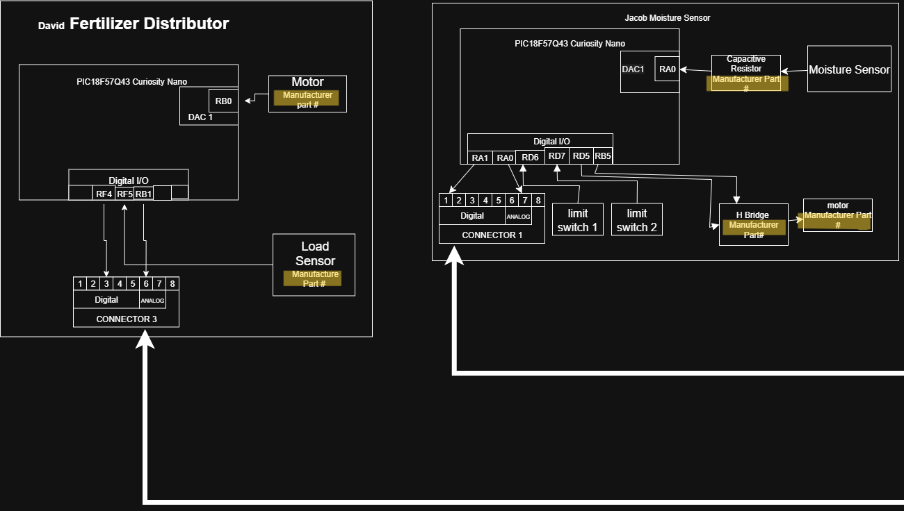

## Introduction

This page lays out how our team plans to connect and communicate across individual boards for our Self Regulating Irrigation Project. Using a shared block diagram, we’re mapping out the wiring, pin assignments, and message flow between teammates to make sure everything fits together and meets the course requirements.
Each teammate is designing their own board, so it’s important to agree on how we’ll use the 8-pin connectors and distribute functionality (Pin 8 is reserved for ground). This setup will help make sure everyone’s subsystem is clearly defined. The diagrams and structure here will guide our team and serve as a reference for the external design later in the semester.

## Research Question

* How can a capacitive resistor measure moisture?
* Is the only way for a pic18F54Q43 to control a motor through an H-Bridge?
* How does I2C communication work?
* Why does the connector need 8 pins if UART and I2c both have 1 receive and 1 send channel?
* How can we ensure the pumps stay primed?

## Images

**Figure 1:** The over all team block diagram.

Here are some close ups so they can be read easier.

**Figure 2:** The left half of the team block diagram.

**Figure 3:** The right half of the team block diagram.

<!-- ADD DRAW.IO FILE INSTEAD OF LINK ALSO ADD PDF AND FIX THESE IMAGES-->
The full diagram can be found as a [pdf version](image/TeamBlockDiagram.pdf) and as a [draw io file.](image/EGR304TeamBlockDiagram.drawio)

<!--
{style width:"350" height:"300;"}
**Figure 2:** Early PCB working design

**Figure 3:** Innovation Showcase Spring '25, where the products were a STEM-themed display that demonstrates a single scientific/engineering concept with the intended user of K-12 students interested in learning about science, technology, engineering, or math.

## Results

1. Numbered Point 1
1. Numbered Point 2
1. Numbered Point 3

## Conclusions and Future Work

## External Links

[example link to idealab](https://idealab.asu.edu)

## Results

1. Numbered Point 1
1. Numbered Point 2
1. Numbered Point 3

## Conclusions and Future Work

## External Links

[example link to idealab](https://idealab.asu.edu)

## References
-->
