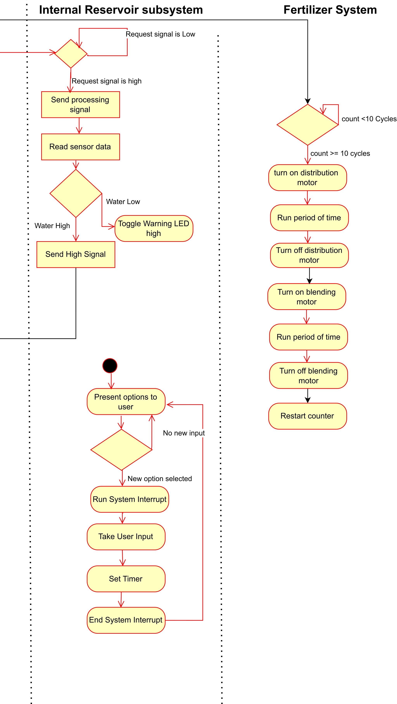

## Introduction

This flow diagram shows how our automatic plant watering and fertilizing system works. It’s designed for people living in apartments or town-homes who want to care for a few indoor plants. The system uses sensors to check soil moisture and water levels, and motors to handle watering and fertilizer mixing. It can water plants on a schedule or based on soil dryness, and it knows when to stop if the tank’s running low. The fertilizer gets stirred in automatically when needed, and everything runs through an internal reservoir that keeps track of water levels and controls the intake from an external tank. The diagram walks through each step to show how the system responds and keeps your plants healthy with minimal effort.

## Images

{style="max-height:300px;"}

**Figure 1:** Majority of the Activity Diagram.

{style="max-height:300px;"}

**Figure 2:** Second half of the Activity Diagram

For closer inspection of the three sections of the main Activity Diagram please visit the ["Software Proposal Appendix"](https://egr304-2025-f-102.github.io/Appendix/App-Software-prop/) page in the appendix.

This is also available as a ["pdf file"](image/Software_Proposal.pdf) or through a ["drawio file"](image/Software_Proposal.drawio)
<!--
## Research Question

* Bullet Point 1
* Bullet Point 2
* Bullet Point 3

## Images

{style width:"350" height:"300;"}
**Figure 2:** Early PCB working design

**Figure 3:** Innovation Showcase Spring '25, where the products were a STEM-themed display that demonstrates a single scientific/engineering concept with the intended user of K-12 students interested in learning about science, technology, engineering, or math.

## Results

1. Numbered Point 1
1. Numbered Point 2
1. Numbered Point 3

## Conclusions and Future Work

## External Links

[example link to idealab](https://idealab.asu.edu)

## Results

1. Numbered Point 1
1. Numbered Point 2
1. Numbered Point 3

## Conclusions and Future Work

## External Links

[example link to idealab](https://idealab.asu.edu)

## References

-->