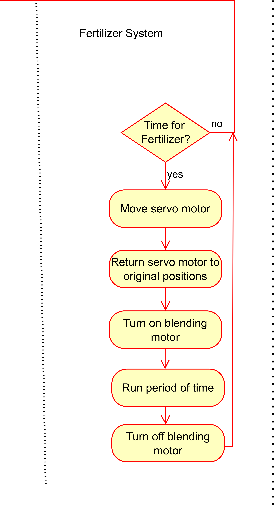

## Introduction

This flow diagram shows how our automatic plant watering and fertilizing system works. It’s designed for people living in apartments or town-homes who want to care for a few indoor plants. The system uses sensors to check soil moisture and water levels, and motors to handle watering and fertilizer mixing. It can water plants on a schedule or based on soil dryness, and it knows when to stop if the tank’s running low. The fertilizer gets stirred in automatically when needed, and everything runs through an internal reservoir that keeps track of water levels and controls the intake from an external tank. The diagram walks through each step to show how the system responds and keeps your plants healthy with minimal effort.

## Images

{style="max-height:400px;"}

**Figure 1:** Majority of the Activity Diagram.

{style="max-height:400px;"}

**Figure 2:** Second half of the Activity Diagram

For closer inspection of the three sections of the main Activity Diagram please visit the ["Software Design Appendix"](https://egr304-2025-f-102.github.io/Appendix/App-Software-prop/) page in the appendix.

## **Alterations since the Original Proposal**

1.Originally, we had four team members on this project. When our team dropped to three, we removed one of our original subsystems—our external reservoir pump. This also required changes in project responsibilities, as we had to redistribute roles within the remaining subsystems.
2. We had planned to communicate over UART, but this proved to be more time-consuming than anticipated. As a result, we changed our design to run solely on high and low signals using GPIO pins.
3.We initially sent signals only when our own systems needed or wanted something, but this made debugging and overall system function extremely difficult. As a team, we sat down and created a handshake system initiated by one subsystem, which greatly simplified the code and improved reliability.
4.
5.

## **Creating Version 2.0**
For Version 2 of our irrigation system, several key design improvements would be implemented to enhance usability, functionality, and long-term performance. One of the primary upgrades would be developing a cleaner, more intuitive user interface with improved visual indicators that clearly communicate system status and operational modes. Alongside these visual cues, we would integrate an audible tone to provide immediate feedback during actions such as mode changes, error notifications, or completed watering cycles. This combination of auditory and visual signaling would make the system significantly easier to operate.

Another meaningful enhancement would be incorporating a small digital clock display. This would serve multiple purposes, including presenting real-time system timing, enabling better scheduling functionality, and supporting future features such as delayed watering, daily logs, or timed maintenance reminders. We would also upgrade the motor and pump connectors by replacing screw terminals with more reliable, user-friendly connectors to improve both safety and ease of assembly.

In terms of hardware performance, Version 2 would prioritize quieter components to reduce operating noise and increase the system’s suitability for indoor environments. The reservoir design would also be revisited. Rather than relying on an internal pump, which limits tank capacity, the updated design would either increase the size of the reservoir or remove the internal pump entirely in favor of an external pump system. This change would allow for greater scalability, easier maintenance, and better compatibility with larger water sources.

Overall, these improvements would make the second version of the system more user-friendly, more expandable, and better suited for real-world use.

This is also available as a ["pdf file"](Software Proposal.drawio.pdf) or through a ["drawio file"](image/Software_Proposal.drawio)
<!--
## Research Question

* Bullet Point 1
* Bullet Point 2
* Bullet Point 3

## Images

{style width:"350" height:"300;"}
**Figure 2:** Early PCB working design

**Figure 3:** Innovation Showcase Spring '25, where the products were a STEM-themed display that demonstrates a single scientific/engineering concept with the intended user of K-12 students interested in learning about science, technology, engineering, or math.

## Results

1. Numbered Point 1
1. Numbered Point 2
1. Numbered Point 3

## Conclusions and Future Work

## External Links

[example link to idealab](https://idealab.asu.edu)

## Results

1. Numbered Point 1
1. Numbered Point 2
1. Numbered Point 3

## Conclusions and Future Work

## External Links

[example link to idealab](https://idealab.asu.edu)

## References

-->